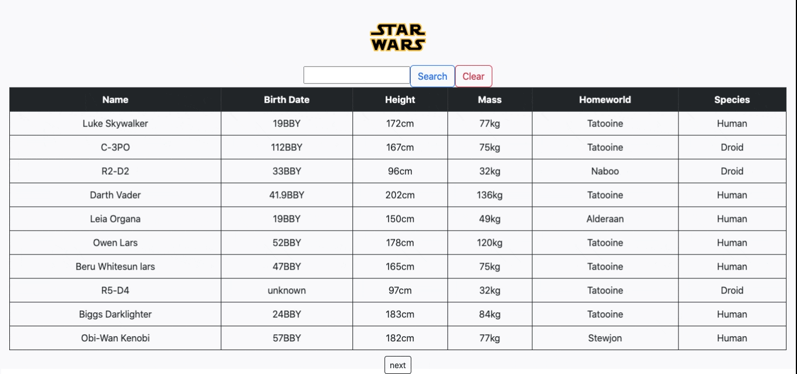

# Star Wars API

### Star Wars API app made with JavaScript, HTML, CSS, React and Bootstrap.

[Click here for the app](https://magenta-crisp-21b3fc.netlify.app)

## Summary

This is a Star Wars Api project that recieves data from [SWAPI](https://swapi.dev/) Users can search their favorite characters through this app, they can type the characters name and see Name, BirthDate, Height, Mass, HomeWorld and Species.
I really enjoyed working on this project,the project gave me a deeper insight on working with State, making HTTP requests using axios. My favorite part of this project was dealing with promises and using asynchronous function to fetch data from the server.

## Author

### Rishav Dev Acharya - Full Stack Software Developer [Linkedin](https://www.linkedin.com/in/rishav-acharya-0482051a7/)
